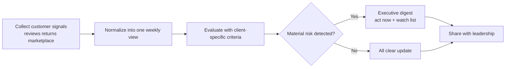
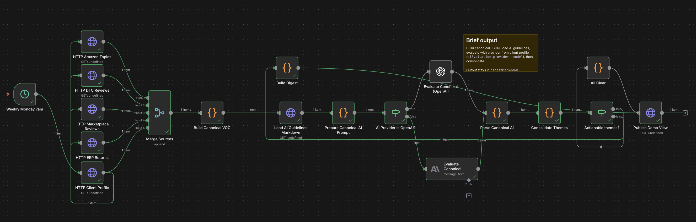
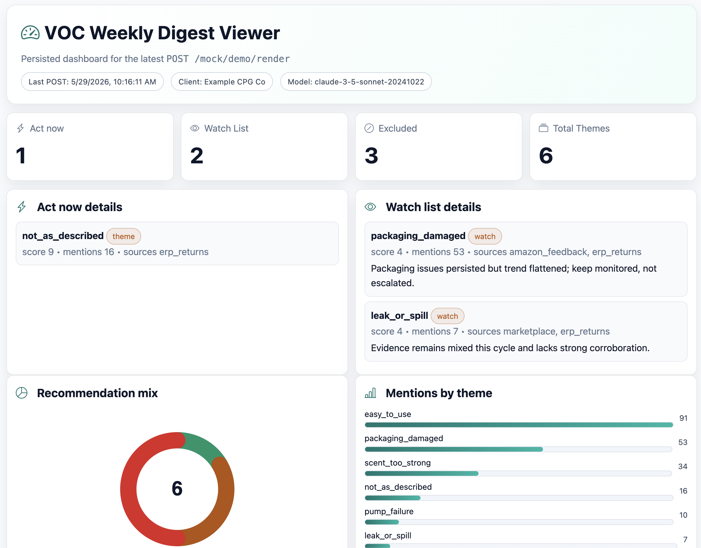

# VOC Weekly Digest

Turns fragmented product feedback into a repeatable weekly operating cadence.
This is a multi-dimensional VOC workflow: multiple product-signal sources are unified, then interpreted and categorized by AI into actionable themes.

## The Operational Problem

Product signals come from many systems (marketplaces, DTC reviews, returns, support), but most teams still lack a single operational view to understand:

- What is actually getting worse
- What needs action now vs monitoring
- Which issues are corroborated across channels

The result is reactive operations, slow prioritization, and inconsistent escalation.

## What This Workflow Improves

This project helps teams improve internal decision quality and execution rhythm by producing a concise weekly digest with:

- **Act now** issues that show meaningful risk
- **Watch list** themes that are emerging
- **All clear** when there is nothing material to escalate
- A plain-language summary leadership can review quickly

## How It Works



## Tech Stack

- Workflow orchestration: `n8n` (scheduled multi-source ingestion + decision flow)
- AI evaluation: `n8n` LangChain nodes (`Anthropic` and `OpenAI` providers)
- Mock APIs and demo viewer: `WireMock`
- Container runtime: `Docker Compose`
- Core logic and wrappers: `Node.js` / JavaScript (`src/voc`, `src/n8n/nodes/wrappers`)
- Build/sync tooling: `npm` scripts + `esbuild`

### Workflow Overview




### Executive Dashboard



## Demo Outcome (What a Client Sees)

Each run ends in one of two outcomes:

1. **Action digest**: priority issues and rationale
2. **All clear**: no urgent issues this cycle

Both outcomes reinforce a stronger internal process: consistent review, clearer prioritization, and faster cross-functional handoffs.

## For Technical Teams (Optional)

### Start / refresh environment

```bash
cp .env.example .env
npm run up
```

What `npm run up` does:

- Runs one-shot `setup` (`docker/setup/sync-workflow.sh`)
- Executes `npm run workflow:sync` to refresh generated workflow artifacts
- Starts `wiremock` and `n8n`
- `n8n` imports `src/n8n/workflows/voc-weekly-digest.json` on boot

AI provider configuration:

- Provider + model selection comes from client profile `aiEvaluation` (`provider`, `model`, optional `models` map)
- API key requirements are also declared in client profile `aiEvaluation.apiKeyEnv`
- API credentials come from env vars and are generated/imported on n8n startup:
  - `VOC_OPENAI_API_KEY` (required)
  - `VOC_ANTHROPIC_API_KEY` (required)
  - `VOC_OPENAI_BASE_URL`, `VOC_ANTHROPIC_BASE_URL` (configurable endpoints)
  - `VOC_OPENAI_MODEL`, `VOC_ANTHROPIC_MODEL` (default models when profile does not specify one)
- Workflow AI nodes are provider-generic; environment targeting (mock vs real endpoints) is resolved through imported credentials, not hardcoded in the workflow
- AI mocks are provider-native only (`/v1/chat/completions` for OpenAI, `/v1/messages` for Anthropic); no generic `/mock/ai/evaluate-themes` path

### Efficient dev loop

- Workflow/wrapper/business-logic changes: run `npm run up`
- WireMock-only changes: run `docker compose restart wiremock`
- Re-import workflow into a running n8n without restart: run `./scripts/import-workflow.sh`

### Source of truth

- Workflow graph definition: `scripts/patch-workflow-ai-graph.js`
- Code node wrapper sources: `src/n8n/nodes/wrappers/`
- Core VOC logic: `src/voc/`
- Generated workflow artifact (imported by n8n): `src/n8n/workflows/voc-weekly-digest.json`

- Workflow UI: http://localhost:5678
- Demo viewer: http://localhost:8080/mock/demo/render/view

## License

MIT
