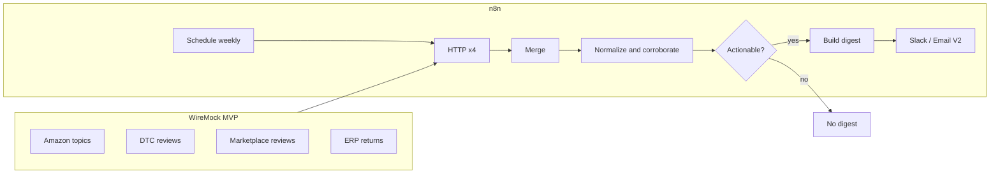

# Architecture

## Corroboration score

Per theme (from taxonomy in `client-profile.json`):

- +1 for each source that mentions the theme (max 3 from review-like sources)
- +2 if ERP returns include a matching reason bucket
- Themes with `score >= minCorroborationScore` appear under **Act now**
- Lower scores → **Watch list** or omitted

## Exception-only

If no theme meets threshold after normalize, workflow ends without sending (log "All clear" in execution).
